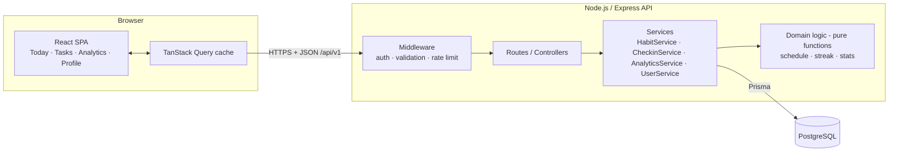
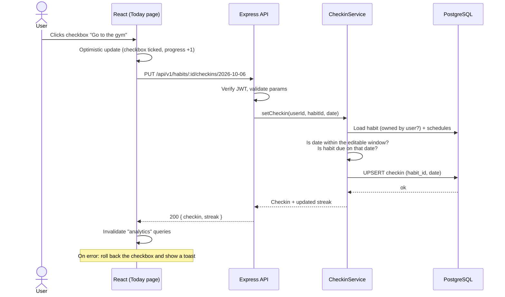
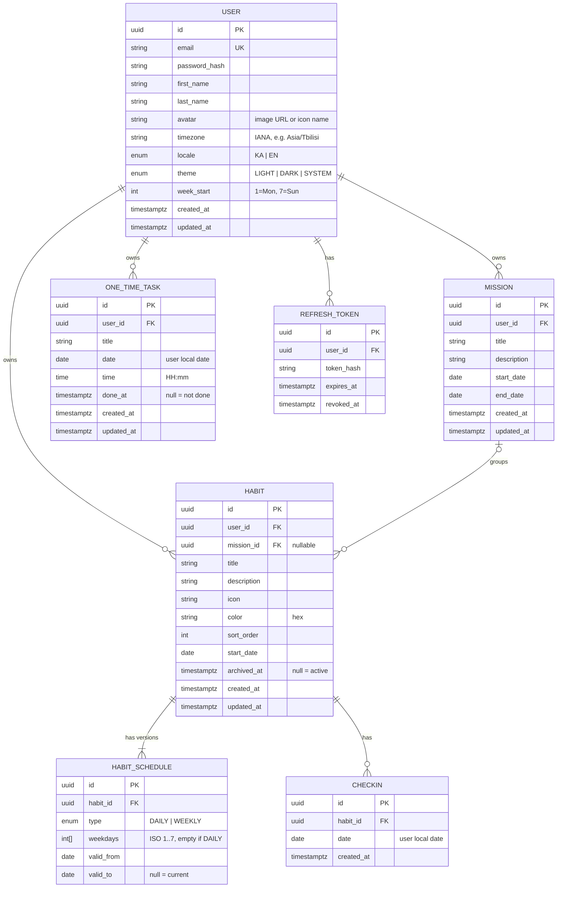
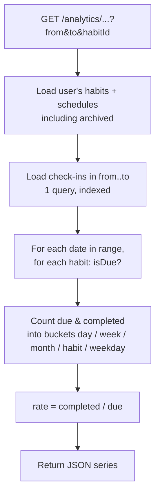
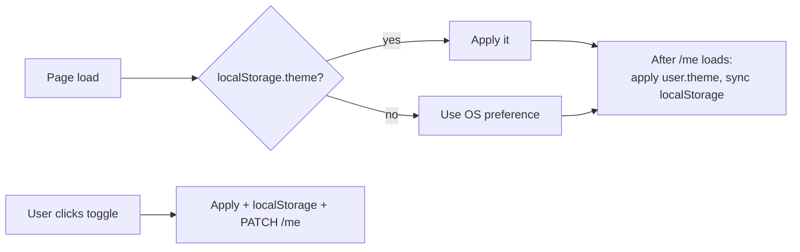

# Daily Tasks Manager — Technical Design Document (TDD)

| | |
|---|---|
| **Status** | v1.2 — **Approved**. Key decisions are final (§17). |
| **Owner** | Team Lead |
| **Audience** | Frontend, backend and QA developers |
| **Repository** | `g-dolidze/todo.app` |
| **Predecessor** | [`g-dolidze/pro_gress`](https://github.com/g-dolidze/pro_gress) (Pro-gress v0.1 MVP). This app is **Pro-gress v2**. |

---

## Table of contents

1. [Summary](#1-summary)
   - [1.1 Upgrade from Pro-gress v0.1](#11-upgrade-from-pro-gress-v01)
2. [Goals and non-goals](#2-goals-and-non-goals)
3. [Glossary](#3-glossary)
4. [User stories and acceptance criteria](#4-user-stories-and-acceptance-criteria)
5. [Tech stack](#5-tech-stack)
6. [Architecture](#6-architecture)
7. [Data model](#7-data-model)
8. [Core logic: scheduling, check-ins, streaks](#8-core-logic-scheduling-check-ins-streaks)
9. [Analytics](#9-analytics)
10. [REST API](#10-rest-api)
11. [Frontend](#11-frontend)
12. [Light and dark mode](#12-light-and-dark-mode)
13. [Authentication and security](#13-authentication-and-security)
14. [Testing strategy and quality bar](#14-testing-strategy-and-quality-bar)
15. [Project structure](#15-project-structure)
16. [Delivery plan](#16-delivery-plan)
17. [Open questions](#17-open-questions)

---

## 1. Summary

**Daily Tasks Manager** is a web app for building habits. A user creates **tasks they want to do regularly**,
such as *"Do exercise"*, *"Learn something new"* or *"Go to the gym"*. Each task repeats either:

- **every day**, or
- **on chosen days of the week** (for example Mon / Wed / Fri).

Every day the user opens the **Today** screen and **checks off** the tasks they did. The app keeps the history
and shows **analytics**:

- **Bar charts** for short periods (this week, last 30 days, per task, per weekday).
- **Line charts** for long periods (3 months, 6 months, 1 year), showing the trend over time.

Every user has their **own account and profile**, and can switch between **light and dark mode**.

Users can also add **one-time tasks** (a single date and time) and group recurring tasks into **missions**
(a goal with a start and end date, e.g. *"30 days of fitness"*). The UI is in **Georgian and English**.

### 1.1 Upgrade from Pro-gress v0.1

This project replaces [`g-dolidze/pro_gress`](https://github.com/g-dolidze/pro_gress). **Every v0.1 feature is kept**;
the upgrade fixes its technical limits (described in pro_gress `docs/TDD.md` §2.2, §10.7, §15.3 and §19.4).

| Area | Pro-gress v0.1 (today) | v2 (this document) |
|------|------------------------|--------------------|
| Data storage | Browser `localStorage` only. Clearing the browser deletes everything. No sync between devices. | **PostgreSQL** on a server. Data is safe and the same on every device. |
| Login | Local test login in the browser (Gmail only). Not real security. | **Real accounts** with server-side auth (§13). Any email address. |
| Repeat rules | `cadence` is **only a label**. Every mission task counts as due **every day**. | **Real schedule engine**: every day or chosen weekdays (§8.1). Missed days are calculated correctly. |
| Recurring tasks | Exist only inside a mission. | Can be standalone **or** belong to a mission. |
| Analytics | CSS bar chart (day / week / month / mission). The "day" chart is fake interpolation. No long-term view. | **Bar charts** for short periods + **line charts** for 3m / 6m / 1y, streaks, per-task and per-weekday stats (§9). |
| Streaks | Not implemented. | Current and longest streak per task (§8.4). |
| Code structure | Logic, state and UI in one 1300-line `app/page.tsx`. | Layered: pure domain functions, services, API, feature folders (§6, §15). |
| Tests | One outdated render test. | Test-driven development, unit + API + component + E2E, enforced by CI (§14). |
| Kept as-is | ka/en UI, light/dark theme, design system colors and font, calendar with day-status badges, missions accordion, guest browsing, profile with avatar. | Same behaviour, re-implemented on the new stack. |

**What developers should reuse from pro_gress (copy, don't rewrite):**

| From `pro_gress` | Use in v2 |
|------------------|-----------|
| `app/i18n.ts` (all ka/en strings) | Starting point for `apps/web/src/i18n/ka.json` and `en.json` (§11.5). |
| `docs/DESIGN_SYSTEM.md` + `app/globals.css` tokens | Color, radius, spacing and font tokens (§12). |
| Calendar badge rules (pro_gress TDD §10.3) | Same complete / partial / missed indicators (§11.6). |
| Responsive breakpoints 820 / 560 / 380 px | Same breakpoints. |
| `public/` icons and Open Graph images | Copy into `apps/web/public/`. |

Existing users bring their data with the **one-time import from localStorage** (§7.4).

---

## 2. Goals and non-goals

### Goals (v2)

| # | Goal |
|---|------|
| G1 | Users can register, log in and manage their own profile. |
| G2 | Users can create, edit, archive and delete recurring tasks (daily or on chosen weekdays). |
| G3 | Users can check or uncheck a task for today, and for past days (up to 7 days back). |
| G4 | Analytics: completion rate, streaks, bar charts (short term), line charts (long term). |
| G5 | Light, dark and "system" theme, saved per user. |
| G6 | Responsive UI that works on phone and desktop browsers (from 320 px). |
| G7 | Keep all Pro-gress v0.1 features: one-time tasks with date and time, missions, calendar with day-status badges, guest browsing. |
| G8 | Georgian (default) and English UI. |
| G9 | Pro-gress v0.1 users can import their browser data into their new account. |

### Non-goals (v2, possible later)

- Native mobile apps.
- Push or email reminders.
- AI planner (v0.1 has only a welcome pop-up; it stays a "coming soon" pop-up).
- Social features (friends, sharing, leaderboards).
- Quantity or duration tasks (e.g. "drink 3 litres"), mentioned in the pro_gress PRD.
- Flexible "N times per week" tasks and tasks repeating every N days or monthly (the data model leaves room, see §7.3).
- Offline mode.

---

## 3. Glossary

| Term | Meaning |
|------|---------|
| **Habit** (ka: ჩვევა) | Something the user wants to do regularly, e.g. "Go to the gym". Called a *habit* in the UI and in code, so it isn't confused with one-time tasks. (The user stories below sometimes say "task" for a habit.) |
| **Schedule** | Which days a task is due: `DAILY`, or `WEEKLY` with a list of weekdays. |
| **Due day** | A calendar date when the task is scheduled. |
| **Check-in** | A record that the user completed a task on a given date. |
| **Completion rate** | `completed due days / all due days` for a period, as a percentage. |
| **Streak** | Number of consecutive **due days** completed, counting back from today. Days when the task is not due do not break the streak. |
| **Local date** | A date (`YYYY-MM-DD`) in the **user's time zone**. All "day" logic uses local dates, never UTC timestamps. |
| **One-time task** | A task for one date and time only, e.g. "Doctor at 15:00 on Oct 9". Same as v0.1 `Task`. Done or not done. |
| **Mission** | A goal with a start and end date that groups recurring tasks, e.g. "30 days of fitness". Same as v0.1 `Mission`. In v0.1 its tasks were called *system tasks* (სისტემური დავალებები); in v2 they are normal recurring tasks with a `missionId`. |
| **Guest mode** | Browsing without an account (as in v0.1). Data stays in the browser until the user signs up. |

---

## 4. User stories and acceptance criteria

### 4.1 Account and profile

| ID | Story | Acceptance criteria |
|----|-------|---------------------|
| US-1 | As a visitor I can sign up with first name, last name, email and password. | Email must be unique and valid. Password needs at least 8 characters with 1 letter and 1 digit. After sign-up I am logged in. The time zone is detected from the browser automatically. |
| US-2 | As a user I can log in and log out. | Wrong credentials show a generic error ("Invalid email or password"). Logout clears the session. |
| US-3 | As a user I can view and edit my profile. | I can edit first and last name, avatar (photo upload or one of the built-in icons, as in v0.1), time zone, language, week start day (Mon/Sun) and theme. I can change my password if I enter the current one. |
| US-4 | As a user I can delete my account. | I must confirm with my password. All my data is deleted permanently. |

### 4.2 Tasks

| ID | Story | Acceptance criteria |
|----|-------|---------------------|
| US-5 | As a user I can create a task. | Fields: title (required, 1–80 chars), description (optional, up to 500 chars), icon/emoji, color, schedule (`DAILY` or `WEEKLY` + at least one weekday), start date (default: today). |
| US-6 | As a user I can edit a task. | A schedule change applies **from today onwards**. History and statistics for past days do not change (see §7.3). |
| US-7 | As a user I can archive a task. | Archived tasks disappear from Today but stay in analytics. They can be restored. |
| US-8 | As a user I can delete a task. | This needs confirmation. It deletes the task and all its check-ins. |
| US-9 | As a user I can reorder tasks. | Drag and drop on the Tasks page. The order is saved. |

### 4.3 Daily check

| ID | Story | Acceptance criteria |
|----|-------|---------------------|
| US-10 | As a user I see the tasks due today. | Only tasks scheduled for today (in my time zone) are shown, with a progress bar such as "3 / 5 done". |
| US-11 | As a user I can check or uncheck a task. | One click toggles it. The UI updates instantly (optimistic update) and rolls back if the request fails. |
| US-12 | As a user I can fix the last 7 days. | A date picker lets me go back up to 7 days. Future dates and older dates are read-only. |

### 4.4 Analytics

| ID | Story | Acceptance criteria |
|----|-------|---------------------|
| US-13 | As a user I see my overall stats. | KPI cards: today's progress, current best streak, completion rate for the last 7 and 30 days. |
| US-14 | As a user I see short-term bar charts. | A **bar chart** of completion % per day for the last 7 or 30 days; a bar chart of completion % per task; a bar chart of completion % per weekday. |
| US-15 | As a user I see long-term line charts. | A **line chart** of completion % over 3 months (weekly points), 6 months (weekly points) or 1 year (monthly points). |
| US-16 | As a user I can filter analytics per task. | A task selector filters every chart to "All tasks", one mission, or one task. |

### 4.5 Kept from Pro-gress v0.1

| ID | Story | Acceptance criteria |
|----|-------|---------------------|
| US-17 | As a user I can add a one-time task. | Title, date and time are required (default time 09:00). It appears on that day in Today and the calendar, sorted by time. I can tick it, untick it, edit it and delete it. |
| US-18 | As a user I can create a mission. | Title, start and end date are required (`end >= start`; default period today + 29 days). At least one recurring task, each with its own schedule. |
| US-19 | As a user I can see and edit missions. | Missions show as an accordion: title, dates, progress %, progress bar. Edit and delete (with confirmation) work as in v0.1. Deleting a mission asks: "Delete its tasks too, or keep them as standalone tasks?" |
| US-20 | As a user I see a month calendar. | 6×7 grid, week starts on my `week_start`. Past days show a badge: green ✓ (all done), yellow `x/y` ring (partly done), red × (nothing done). Today and future days show the number of planned tasks. Clicking a day opens it in Today (editable only within the 7-day window). |
| US-21 | As a user I can switch language. | ka / en switcher in the header. It translates the whole UI, dates and accessibility labels. The choice is saved to my profile (and in `localStorage` for guests). |
| US-22 | As a visitor I can browse as a guest. | Without an account I can try the app. Data is kept in the browser. When I sign up, it is imported into my account automatically (§7.4). |
| US-23 | As a Pro-gress v0.1 user I can import my data. | On first login on the same browser the app finds old v0.1 data and offers "Import". After import, my tasks, missions and check-ins are in my account. Running it twice does not create duplicates. |

---

## 5. Tech stack

| Layer | Choice | Why |
|-------|--------|-----|
| Language | **TypeScript** everywhere | One language and shared types between frontend and backend. |
| Frontend | **React 19 + Vite 8** | Fast dev server, widely known. |
| Routing | **React Router** | Standard. |
| Server state | **TanStack Query** | Caching and optimistic updates for check-ins. |
| Forms / validation | **React Hook Form + Zod** | The same Zod schemas validate on the server (shared package). |
| Styling | **Tailwind CSS 4** with a `dark` variant on `[data-theme='dark']` | Easy light/dark theming. |
| Charts | **Recharts** | Has `BarChart` and `LineChart` built in, responsive, works with React. |
| Backend | **Node.js 22 + Express 5** | Simple and well known. Express 5 forwards async errors to the error handler. |
| ORM | **Prisma 7** (`prisma-client` generator + `@prisma/adapter-pg`) | Type-safe DB access and migrations. Business-rule `CHECK` constraints are added by hand in the migration SQL. |
| Database | **PostgreSQL 16** | Relational data with good date support. |
| Auth | JWT access token plus refresh token in an **httpOnly cookie** | See §13. |
| Testing | **Vitest**, **Supertest**, **React Testing Library**, **Playwright**, **Storybook**, **axe**, **Lighthouse CI** | See §14. |
| Tooling | pnpm workspaces, ESLint, Prettier | Monorepo with shared code. |
| CI | GitHub Actions | Lint, typecheck and tests on every PR. |
| Deploy | Frontend: Vercel. Backend and DB: Render or Railway. | Cheap and easy to start with. |

---

## 6. Architecture



**Layering rules (important):**

1. **Controllers** only parse the request, call a service and send the response. No business logic.
2. **Services** do the work: they load data, call domain functions and save data.
3. **Domain functions** in `packages/shared/src/domain` are **pure** (no DB, no `Date.now()`; "today" is
   passed in as a parameter). That makes them easy to unit-test and lets the frontend reuse them.
4. All dates that mean a "day" travel as `YYYY-MM-DD` strings. Use the `date-fns` and `date-fns-tz` libraries;
   **never** call `new Date('2026-10-06')` directly, because it parses as UTC and shifts the day.

### 6.1 Request flow example: checking a task



---

## 7. Data model

### 7.1 ER diagram



### 7.2 Constraints and indexes

| Table | Constraint / index | Reason |
|-------|--------------------|--------|
| `user` | `UNIQUE(email)` (stored lowercase) | One account per email. |
| `habit` | `INDEX(user_id, archived_at, sort_order)` | Fast Today and Tasks lists. |
| `habit_schedule` | `INDEX(habit_id, valid_from)` | Schedule lookups by date. |
| `checkin` | **`UNIQUE(habit_id, date)`** | A task can be done at most once per day, which makes the toggle idempotent. |
| `checkin` | `INDEX(habit_id, date)` | Range queries for analytics. |
| `mission` | `CHECK(end_date >= start_date)`, `INDEX(user_id, end_date)` | Valid period; list active missions fast. |
| `one_time_task` | `INDEX(user_id, date, time)` | Today list and calendar, sorted by time. |
| `habit.mission_id` | FK `ON DELETE SET NULL` (or the service deletes the habits first if the user chose "delete tasks too") | Matches US-19. |

**Mission tasks are habits.** A habit with `mission_id` is due only while the mission runs:
`isDue` also checks `mission.start_date <= date <= mission.end_date` (§8.1). Mission progress uses the same
`due / completed` formula as all other analytics (§9.1). This fixes v0.1, where the formula was `days × tasks`
no matter which days each task was scheduled for.
| all FKs | `ON DELETE CASCADE` | Deleting a user or task removes its data. |

A row in `checkin` means **done**. No row means **not done**. "Missed" is never stored; it is
**calculated** (a due day in the past without a check-in).

### 7.3 Why schedules are versioned

When a user changes "Go to gym" from *Mon/Wed/Fri* to *every day*, last month's statistics must
**not** change. So we never edit a schedule in place:

1. Close the current version: `valid_to = yesterday`.
2. Insert a new version: `valid_from = today`, `valid_to = null`.

If the old version started today, overwrite it instead (no zero-length versions).

To find the schedule for a date `d`, use the version where `valid_from <= d AND (valid_to IS NULL OR d <= valid_to)`.

> Adding new schedule types later (e.g. `EVERY_N_DAYS`) only needs a new enum value, an extra column
> (`interval`), and a new branch in `isDue()`.

### 7.4 Import from Pro-gress v0.1 (and from guest mode)

Pro-gress v0.1 saves data in the browser under these `localStorage` keys (see pro_gress `docs/TDD.md` §8.1):

| v0.1 key | Contents |
|----------|----------|
| `progress-tasks-v2:{userId}` (or legacy `progress-tasks-v2`) | `Task[]`: `{ id, title, date, time, done, type: "one-time" }` |
| `progress-missions-v4:{userId}` (or legacy `progress-missions-v4`) | `Mission[]`: `{ id, title, startDate, endDate, tasks: [{ id, title, cadence, completions: { "YYYY-MM-DD": boolean } }] }` |
| `progress-theme`, `progress-locale` | `light \| dark`, `ka \| en` |

**Flow:**

1. After login, the web app checks for these keys. If found, it shows an "Import your Pro-gress data" banner.
2. The browser reads the keys, validates them with a Zod schema (`ProgressV01ExportSchema` in `packages/shared`), and
   sends `POST /api/v1/import/progress-v01`. Corrupt entries are skipped and reported back, never fatal.
3. The server maps everything **in one DB transaction**:

| v0.1 | v2 |
|------|----|
| `Task` | `one_time_task` (`done: true` → `done_at = now()`) |
| `Mission` | `mission` |
| `MissionTask` | `habit` with `mission_id`, `start_date = mission.startDate`, plus a schedule from the table below |
| `completions[date] === true` | `checkin(habit_id, date)` (the 7-day edit limit does **not** apply to import) |
| `progress-theme` / `progress-locale` | `user.theme` / `user.locale`, only if the user has not changed them yet |

| v0.1 `cadence` (stored as Georgian text) | v2 schedule |
|------------------------------------------|-------------|
| `ყოველდღე` (every day) | `DAILY` |
| `სამუშაო დღეებში` (on weekdays) | `WEEKLY [1,2,3,4,5]` |
| `კვირაში 3-ჯერ` (3 times a week) | `WEEKLY [1,3,5]`, and the import report tells the user to adjust it |
| `კვირაში ერთხელ` (once a week) | `WEEKLY [1]`, and the import report tells the user to adjust it |
| anything else | `DAILY` (this matches how v0.1 counted it) |

4. **No duplicates:** each imported row stores `legacy_id` (the v0.1 numeric id), with `UNIQUE(user_id, legacy_id)`
   on `mission`, `habit` and `one_time_task`. A second import updates rows instead of adding new ones.
5. After a successful import the browser keeps the old keys for 30 days (as a backup), then deletes them.

**Guest mode** uses the same path: guest data is stored in the browser in the **v0.1 format** with the key prefix
`progress-guest`, so signing up reuses the same import endpoint. Guests have no analytics beyond today and the
calendar (analytics need the server).

---

## 8. Core logic: scheduling, check-ins, streaks

All functions in this section live in `packages/shared/src/domain/` and are **pure**.

### 8.1 Is a task due on a date?

```ts
type ISODate = string; // 'YYYY-MM-DD'
type Weekday = 1 | 2 | 3 | 4 | 5 | 6 | 7; // ISO: 1 = Monday ... 7 = Sunday

interface Schedule {
  type: 'DAILY' | 'WEEKLY';
  weekdays: Weekday[];
  validFrom: ISODate;
  validTo: ISODate | null;
}

interface HabitForDomain {
  startDate: ISODate;
  archivedOn: ISODate | null; // local date of archived_at
  mission: { startDate: ISODate; endDate: ISODate } | null;
  schedules: Schedule[];
}

function isDue(habit: HabitForDomain, date: ISODate): boolean {
  if (date < habit.startDate) return false;                        // not started yet
  if (habit.archivedOn && date >= habit.archivedOn) return false; // archived
  if (habit.mission && (date < habit.mission.startDate || date > habit.mission.endDate))
    return false;                                                  // outside its mission
  const s = habit.schedules.find(
    (v) => v.validFrom <= date && (v.validTo === null || date <= v.validTo),
  );
  if (!s) return false;
  if (s.type === 'DAILY') return true;
  return s.weekdays.includes(isoWeekday(date));                   // WEEKLY
}
```

> `ISODate` strings compare correctly with `<` and `>` because the format is fixed-width.

### 8.2 "Today" for a user

```ts
// Server: never use the server's local day. Always use the user's time zone.
const today = formatInTimeZone(new Date(), user.timezone, 'yyyy-MM-dd');
```

### 8.3 Check-in rules (server enforces them; the UI only mirrors them)

| Rule | Error |
|------|-------|
| The task belongs to the current user | `404 NOT_FOUND` (do not reveal that it exists) |
| `date <= today` (user time zone) | `422 DATE_IN_FUTURE` |
| `date >= today − 7 days` | `422 DATE_TOO_OLD` |
| `isDue(habit, date)` is true | `422 NOT_DUE` |

- `PUT` creates the check-in. Calling it twice is fine (upsert, idempotent).
- `DELETE` removes it. Calling it twice is fine (deleting nothing returns `204`).

### 8.4 Streaks

**Current streak**: walk backwards from today over **due days only**:

```ts
function currentStreak(habit, doneDates: Set<ISODate>, today: ISODate): number {
  let streak = 0;
  let d = today;
  // Today not done yet does NOT break the streak (the day isn't over).
  if (isDue(habit, d) && !doneDates.has(d)) d = addDays(d, -1);
  while (d >= habit.startDate) {
    if (isDue(habit, d)) {
      if (!doneDates.has(d)) break;
      streak++;
    }
    d = addDays(d, -1);
  }
  return streak;
}
```

**Longest streak**: the same walk forwards from `startDate` to `today`, keeping the maximum.

**Example**: a task due Mon/Wed/Fri, done Mon ✅, Wed ✅, Fri ✅, today is Sunday → streak = **3**.
Tuesday, Thursday, Saturday and Sunday don't count because the task isn't due on them.

---

## 9. Analytics

### 9.1 Base formula

For any period and any set of tasks:

```
due       = number of (habit, date) pairs where isDue(habit, date) and date <= today
            + number of one-time tasks whose date is in the period and <= today
completed = number of those that are done (check-in exists / done_at is set)
rate      = due == 0 ? null : completed / due * 100   (rounded to 1 decimal)
```

Every task has the same weight (as in v0.1). One-time tasks count in the **daily**, **trend**, **weekday** and
**calendar** numbers, but not in **per-task** charts or streaks, because they happen only once.

`rate = null` means *no data* (for example the user had no tasks yet). The chart shows a **gap**, not 0%.

### 9.2 Which chart is used where

| Widget | Chart | Period | X axis | Y axis | Granularity |
|--------|-------|--------|--------|--------|-------------|
| KPI cards | numbers | today, 7d, 30d | — | — | — |
| **Daily completion** | **Bar** | last 7 or 30 days | date | % done | 1 bar per day |
| **Per task** | **Bar** (horizontal) | 7d / 30d / 90d | % done | task name | 1 bar per task |
| **Per weekday** | **Bar** | last 90 days | Mon…Sun | % done | 1 bar per weekday |
| **Long-term trend** | **Line** | 3m / 6m / 1y | week or month | % done | 3m and 6m: weekly; 1y: monthly |
| **Per mission** | **Bar** (horizontal) | mission start → min(today, end) | % done | mission name | 1 bar per mission |
| Streak history (optional) | Line | 1y | date | streak length | daily |
| Calendar badges | ✓ / ring / × | the visible month | — | — | 1 badge per past day |

The v0.1 "day by hour" chart is **removed**. It was a made-up interpolation, not real data (pro_gress TDD §10.7).

**Rule of thumb:** periods of **30 days or less use bars**, so each day can be compared on its own.
**Longer periods use lines**, to show the trend over time.

### 9.3 How the server calculates it



- Calculations happen **in the service, in memory**. With at most about 50 tasks × 366 days = ~18k checks,
  this is fast enough (well under 50 ms). Do not pre-aggregate yet.
- Week buckets start on the user's `week_start`. Month buckets are calendar months.
- A partial current week or month is included and flagged `partial: true`, so the UI can draw it dashed or lighter.
- **Later optimisation (only if needed):** a nightly `daily_stats(user_id, date, due, completed)` table.

### 9.4 Response shape (shared type)

```ts
interface SeriesPoint {
  key: string;          // '2026-10-06' | '2026-W41' | '2026-10' | habitId | '1'..'7'
  label: string;        // 'Mon 6' | 'Oct 6–12' | 'Oct 2026' | 'Go to gym' | 'Mon'
  due: number;
  completed: number;
  rate: number | null;  // 0..100
  partial?: boolean;
}
```

---

## 10. REST API

Base URL: `/api/v1`. JSON only. All endpoints except `/auth/*` require `Authorization: Bearer <accessToken>`.
Request bodies are validated with **Zod** schemas from `packages/shared`.

### 10.1 Error format (for every error)

```json
{ "error": { "code": "NOT_DUE", "message": "Habit is not scheduled on 2026-10-05", "details": {} } }
```

| HTTP | When |
|------|------|
| 400 | Malformed JSON or failed validation (`VALIDATION_ERROR`, `details` holds the field errors) |
| 401 | Missing or expired token (`UNAUTHORIZED`) |
| 404 | Resource does not exist **or belongs to someone else** |
| 409 | Conflict, e.g. `EMAIL_TAKEN` |
| 422 | Business rule broken (`DATE_IN_FUTURE`, `DATE_TOO_OLD`, `NOT_DUE`) |
| 429 | Rate limited |

### 10.2 Endpoints

**Auth**

| Method | Path | Body | Response |
|--------|------|------|----------|
| POST | `/auth/register` | `{ firstName, lastName, email, password, timezone, locale }` | `201 { accessToken, user }` + refresh cookie |
| POST | `/auth/login` | `{ email, password }` | `200 { accessToken, user }` + refresh cookie |
| POST | `/auth/refresh` | — (cookie) | `200 { accessToken }` (rotates refresh token) |
| POST | `/auth/logout` | — | `204`, revokes the refresh token |

**Profile**

| Method | Path | Body | Response |
|--------|------|------|----------|
| GET | `/me` | — | `200 User` |
| PATCH | `/me` | `{ firstName?, lastName?, avatar?, timezone?, locale?, theme?, weekStart? }` | `200 User` |
| PUT | `/me/password` | `{ currentPassword, newPassword }` | `204` |
| DELETE | `/me` | `{ password }` | `204` |

**Tasks (habits)**

| Method | Path | Body / Query | Response |
|--------|------|--------------|----------|
| GET | `/habits` | `?status=active\|archived\|all` | `200 Habit[]` (with current schedule) |
| POST | `/habits` | `{ title, description?, icon?, color?, startDate?, schedule: { type, weekdays? } }` | `201 Habit` |
| GET | `/habits/:id` | — | `200 Habit` + `currentStreak`, `longestStreak` |
| PATCH | `/habits/:id` | any of the POST fields | `200 Habit` (a schedule change creates a new version) |
| POST | `/habits/:id/archive` | — | `200 Habit` |
| POST | `/habits/:id/restore` | — | `200 Habit` |
| DELETE | `/habits/:id` | — | `204` |
| PUT | `/habits/order` | `{ ids: uuid[] }` | `204` |

**Today and check-ins**

| Method | Path | Response |
|--------|------|----------|
| GET | `/today?date=YYYY-MM-DD` (default: today) | `200 { date, habits: [{ habit, done, streak }], missionHabits: [...], oneTimeTasks: [...], done, total }` |
| PUT | `/habits/:id/checkins/:date` | `200 { checkin, currentStreak }` |
| DELETE | `/habits/:id/checkins/:date` | `200 { currentStreak }` |

**Analytics** (all accept `habitId?` to filter to one task)

| Method | Path | Query | Response |
|--------|------|-------|----------|
| GET | `/analytics/summary` | — | `{ today: {done,total}, rate7d, rate30d, bestCurrentStreak, longestStreak }` |
| GET | `/analytics/daily` | `range=7d\|30d` | `SeriesPoint[]` (one per day) → bar chart |
| GET | `/analytics/by-habit` | `range=7d\|30d\|90d` | `SeriesPoint[]` (one per task) → bar chart |
| GET | `/analytics/by-weekday` | `range=90d` | `SeriesPoint[]` (7 points) → bar chart |
| GET | `/analytics/trend` | `range=3m\|6m\|1y` | `SeriesPoint[]` (weeks or months) → line chart |
| GET | `/analytics/by-mission` | — | `SeriesPoint[]` (one per mission) → bar chart |
| GET | `/calendar` | `month=YYYY-MM` | `[{ date, due, completed, status: 'complete'\|'partial'\|'missed'\|'planned'\|'empty' }]` |

**One-time tasks**

| Method | Path | Body / Query | Response |
|--------|------|--------------|----------|
| GET | `/tasks` | `?from=YYYY-MM-DD&to=YYYY-MM-DD` | `200 OneTimeTask[]` sorted by date and time |
| POST | `/tasks` | `{ title, date, time }` | `201 OneTimeTask` |
| PATCH | `/tasks/:id` | `{ title?, date?, time?, done? }` | `200 OneTimeTask` |
| DELETE | `/tasks/:id` | — | `204` |

**Missions**

| Method | Path | Body | Response |
|--------|------|------|----------|
| GET | `/missions` | `?status=active\|finished\|all` | `200 Mission[]` with `progress { due, completed, rate }` and their habits |
| POST | `/missions` | `{ title, description?, startDate, endDate, habits: [{ title, schedule }] }` (at least 1) | `201 Mission` (creates the mission and its habits in one transaction) |
| PATCH | `/missions/:id` | `{ title?, description?, startDate?, endDate? }` | `200 Mission` |
| DELETE | `/missions/:id` | `?deleteTasks=true\|false` | `204` |

Mission tasks are added, edited and removed with the normal `/habits` endpoints, using `missionId`.

**Import**

| Method | Path | Body | Response |
|--------|------|------|----------|
| POST | `/import/progress-v01` | `{ tasks: Task[], missions: Mission[], theme?, locale? }` (v0.1 format, §7.4) | `200 { imported: { tasks, missions, habits, checkins }, skipped: [{ reason, item }], scheduleWarnings: [...] }` |

`/today` returns three groups (standalone habits, mission habits, one-time tasks), the same groups v0.1 shows separately.

---

## 11. Frontend

### 11.1 Pages and routes

| Route | Page | Main content |
|-------|------|--------------|
| `/login`, `/register` | Auth | Forms. Redirect to `/` if already logged in. |
| `/` | **Today** | Date switcher (‹ today ›, max 7 days back), daily progress ring, three groups (tasks · mission tasks · one-time tasks) with checkboxes and streak 🔥, quick-add button, small month calendar (§11.6). |
| `/missions` | **Missions** | Mission accordion (title, dates, progress bar, %), create/edit dialog with its recurring tasks, delete with confirmation. |
| `/calendar` | **Calendar** | Large month calendar with day badges. Clicking a day shows its tasks. |
| `/habits` | **Habits** (ka: ჩვევები) | All habits, drag to reorder, add/edit dialog, archive/delete, "Archived" tab. |
| `/analytics` | **Analytics** | Task filter, KPI cards, daily **bar**, per-task **bar**, per-weekday **bar**, trend **line** with 3m/6m/1y tabs. |
| `/profile` | **Profile** | Avatar, first and last name, email (read-only), time zone, language, week start, theme toggle, change password, delete account. |

Every page except auth sits inside `AppLayout`: a top bar (logo, ka/en switch, theme toggle, "AI planner — coming soon"
button, avatar menu) plus side navigation on desktop or bottom navigation on mobile (below 820 px).

### 11.2 Task form: schedule selector

```
Repeat:   (●) Every day   ( ) On specific days
Days:     [Mon] [Tue] [Wed] [Thu] [Fri] [Sat] [Sun]   ← shown only for "specific days", at least 1 required
```

### 11.3 State management

- **Server data** (habits, today, analytics, profile) lives only in **TanStack Query**. Query keys:
  `['me']`, `['habits', status]`, `['today', date]`, `['analytics', kind, range, habitId]`.
- **Check-in toggle** uses an optimistic update on `['today', date]`. On success it invalidates `['analytics']`
  and `['habits']` (because streaks change).
- **UI-only state** (open dialogs, selected tab) stays in React component state. No Redux needed.
- **Guest mode:** query hooks call a `DataSource` interface with two implementations: `ApiDataSource` (logged in)
  and `LocalDataSource` (guest, browser storage in the v0.1 format, §7.4). Components never know which one is used.
  `LocalDataSource` reuses the pure functions from `packages/shared/src/domain`, so guests get the same rules.
- **Auth**: the access token is kept **in memory** (an `AuthContext`), never in `localStorage`. On a 401 the API client calls
  `/auth/refresh` once, then retries the request; if refresh fails it redirects to `/login`.

### 11.4 Charts (Recharts)

- Wrap every chart in `ResponsiveContainer` so it works on mobile.
- Y axis is always **0–100 %**, so charts are comparable.
- `rate === null` → bar not drawn / line gap (`connectNulls={false}`).
- Tooltip shows `completed / due (rate%)`, for example *"4 / 5 (80%)"*.
- Chart colors come from CSS variables (§12), so charts follow the theme automatically.
- Each chart has an empty state ("No data yet — check in a few days to see your progress").

### 11.5 Languages (ka / en)

- Library: **i18next + react-i18next**. Files: `apps/web/src/i18n/ka.json` and `en.json`. Fill them from pro_gress
  `app/i18n.ts` (the same keys, converted to JSON).
- **Georgian is the default.** Order of choice: `user.locale` → `localStorage['progress-locale']` → `ka`.
- Set `<html lang>` to the active language.
- **Dates:** many browsers (some Chromium builds, Android WebView) have **no Georgian locale data**, and
  `Intl.DateTimeFormat('ka-GE')` silently falls back to English. So Georgian month and weekday names are built in
  (`apps/web/src/lib/dates.ts`); English uses `Intl`. Always format dates through that module.
- **No CSS `uppercase` on Georgian text:** browsers turn it into Mtavruli capitals. Use `[:lang(en)_&]:uppercase`.
- **Never** hard-code text in components. A CI check fails if `ka.json` and `en.json` do not have the same keys.
- API error `code`s are translated in the browser (`errors.NOT_DUE` …). The server never sends translated text.
- Font: **Noto Sans Georgian** (Georgian + Latin subsets), as in v0.1.
- Test with long Georgian titles: they must wrap and never break the layout.

### 11.6 Calendar

Same rules as v0.1 (pro_gress TDD §10.3 and §11). The data comes from `GET /calendar?month=YYYY-MM`.

| Day | Condition | Badge |
|-----|-----------|-------|
| Past, `due > 0`, `completed == due` | complete | green filled circle with ✓ |
| Past, `completed == 0` | missed | red filled circle with × |
| Past, partly done | partial | yellow ring (conic gradient), text `completed/due` |
| Today or future, `due > 0` | planned | number of planned tasks |
| No tasks | empty | no badge |

The grid always has 42 cells (6 weeks). Days from the previous and next month are greyed out. "Selected" and "today"
have separate styles. Below 560 px the small calendar scrolls horizontally.

---

## 12. Light and dark mode

**Options:** `LIGHT`, `DARK`, `SYSTEM` (follows the OS setting). The default for new users is `SYSTEM`.

**How it works:**

1. Colors are defined **once** as CSS variables in `apps/web/src/styles/index.css`, and Tailwind exposes them as
   utilities (`bg-surface`, `text-muted`, `text-primary`, `bg-mission-soft` …). Values come from the **Pro-gress design
   system** (pro_gress `docs/DESIGN_SYSTEM.md` and `app/globals.css`), with two changes for WCAG AA contrast:

   | Token | v0.1 value | v2 value | Why |
   |-------|-----------|----------|-----|
   | `--muted` (light) | `#6D7772` | `#5E6863` | v0.1 grey text was 4.2:1 on the background (needs 4.5:1) |
   | `--primary` (light) | `#2F887A` | `#27786B` | green text/buttons were 3.9:1; `#2F887A` stays as `--primary-accent` for rings, bars and the logo |
   | `--primary` (dark) | `#2F887A` | `#4FB3A1` | green text on the dark background needs to be lighter |
   Keep the rest of the design system too: card radius 18–22 px, control radius 10–14 px, 4 px spacing grid,
   max content width 1240 px, purple for everything about missions.
2. `data-theme="dark"` on `<html>` switches the theme (same attribute as v0.1). Tailwind's `dark:` variant targets it.
3. **Avoid a flash of the wrong theme:** a small inline script in `index.html` runs before React loads.
   It reads `localStorage['progress-theme']` (`light` | `dark` | `system`, compatible with v0.1) and sets the attribute
   immediately. The header button switches light ↔ dark; the profile page also offers "System".
4. After login, the **server value** (`user.theme`) is the source of truth. It is copied to `localStorage` and applied.
5. Toggling the theme updates the UI instantly, saves to `localStorage`, and sends `PATCH /me { theme }`.
6. With `SYSTEM`, listen to `matchMedia('(prefers-color-scheme: dark)')` changes and update live.



**Rule:** no hard-coded colors in components. Always use the theme tokens. Both themes must meet WCAG AA contrast.

---

## 13. Authentication and security

| Topic | Decision |
|-------|----------|
| Passwords | Hashed with **argon2id** (or bcrypt with cost 12). Never logged. |
| Access token | JWT, valid **15 min**, payload `{ sub: userId }`, kept in memory on the client. |
| Refresh token | Random 256-bit value, valid **30 days**, stored **hashed** in DB, sent as a `httpOnly; Secure; SameSite=Strict` cookie on path `/api/v1/auth`. **Rotated** on every refresh; reuse of an old token revokes all of the user's tokens. |
| Authorization | **Every** query is scoped by `userId` from the token (`where: { id, userId }`). Another user's resource → `404`. |
| Validation | Zod on every body, param and query. Reject unknown fields. |
| Rate limiting | `/auth/*`: 10 requests/min per IP. Everything else: 300 requests/min per user. |
| Headers | `helmet`, CORS allowing only the frontend origin. |
| Secrets | Only in environment variables (`DATABASE_URL`, `JWT_SECRET`, …). `.env` is git-ignored; `.env.example` is committed. |
| Account deletion | Hard delete with cascade. |

---

## 14. Testing strategy and quality bar

We use **test-driven development** for the domain logic and the API: **write the failing test first**,
then the code, then refactor.

### 14.1 Test pyramid

| Level | Tool | What | Target |
|-------|------|------|--------|
| **Unit** | Vitest | `isDue`, streaks, analytics bucketing, date helpers, Zod schemas | **≥ 95 %** coverage of `packages/shared/src/domain` |
| **Integration (API)** | Vitest + Supertest + real Postgres (Docker / Testcontainers) | Every endpoint: happy path, validation, auth, ownership | Every endpoint and every error code |
| **Component** | Vitest + React Testing Library | Forms, Today list toggle and rollback, theme toggle, chart empty states | Key components |
| **E2E** | Playwright | Critical user journeys in a real browser | 5 journeys below |

### 14.2 Must-have unit test cases

| Function | Cases |
|----------|-------|
| `isDue` | Daily task is due every day · Weekly Mon/Wed/Fri is due only on those days · Before `startDate` → false · On or after archive date → false · Schedule changed mid-month: old days use the old schedule, new days use the new one |
| `currentStreak` | No check-ins → 0 · Today not done yet doesn't break the streak · A missed due day breaks it · Non-due days are skipped (Mon/Wed/Fri example = 3) · Streak does not go before `startDate` |
| `longestStreak` | Picks the maximum run across gaps |
| `isDue` with mission | Mission habit is not due before the mission starts or after it ends |
| Calendar status | complete / partial / missed / planned / empty, exactly as in §11.6 |
| v0.1 import mapping | Each of the 4 Georgian cadence labels maps as in §7.4 · unknown label → `DAILY` · `completions[d] = false` creates no check-in · corrupt entry is skipped, not fatal |
| Analytics | `due = 0` → `rate = null` · Week buckets respect `weekStart` · Partial current week flagged · Archived tasks counted only before archive · Future days never counted |
| Dates | User in `Pacific/Auckland` vs `America/Los_Angeles`: "today" differs at the same instant · DST change days have no missing or duplicated date |

### 14.3 API integration cases (examples)

- `PUT /habits/:id/checkins/:date` twice → still exactly 1 row (idempotent).
- Check-in for a future date → `422 DATE_IN_FUTURE`; 8 days ago → `422 DATE_TOO_OLD`; non-due day → `422 NOT_DUE`.
- User A requests user B's habit → `404`.
- `PATCH /habits/:id` with a new schedule → past analytics unchanged, new schedule active from today.
- Register with an existing email → `409 EMAIL_TAKEN`.
- Refresh token reused after rotation → `401` and all of the user's sessions revoked.
- `POST /import/progress-v01` twice with the same data → same row counts (no duplicates).
- `DELETE /missions/:id?deleteTasks=false` → its habits remain, with `missionId = null`.
- Mission with `endDate < startDate` → `400 VALIDATION_ERROR`.

### 14.4 E2E journeys (Playwright)

1. Sign up → create "Go to gym" (Mon/Wed/Fri) → it appears on Today only on those days.
2. Check a task → progress bar updates → reload → still checked.
3. Analytics shows a bar for today with the correct % and switches to the line chart for 3 months.
4. Toggle dark mode → reload → still dark; log in on another browser → dark too.
5. Edit profile name and time zone → Today recalculates.
6. Switch to English → the whole UI and dates are in English → reload → still English.
7. Put a real v0.1 `localStorage` snapshot in the browser → log in → import → missions, tasks and calendar badges match v0.1.
8. Use the app as a guest → sign up → the guest data is in the new account.
9. Create a mission with 2 tasks → tick them on Today → the mission progress bar updates.

> Tests that depend on "today" must **freeze time** (`vi.setSystemTime` / Playwright `clock`) so they are stable.

### 14.5 CI (GitHub Actions, on every PR)

`pnpm install` → `lint` → `typecheck` → `i18n:check` → `test:unit` → `test:api` (Postgres service container) → `build`
→ `test:e2e` → `test:visual` → `lighthouse`.
**A PR cannot be merged unless CI is green** and at least one teammate has approved it.

### 14.6 Quality bar: "looks good and works perfectly"

The product owner's top requirement is that the app **looks polished and has no bugs**. These rules make that
measurable. **A feature is not done until it passes all of them.**

**Looks good**

| Rule | How we check it |
|------|-----------------|
| Every UI component is built and reviewed in **Storybook** in all 4 combinations: light/dark × ka/en. | Storybook build in CI; the designer or team lead approves new components. |
| **Visual regression tests:** Playwright screenshots of every page at **320, 768 and 1440 px**, light and dark, ka and en. | `test:visual` fails on any unexpected pixel change. Intended changes update the baseline in the same PR. |
| Only design tokens (§12): no raw colors, font sizes or spacing in components. | ESLint rule + review. |
| Every screen has **loading** (skeletons, not spinners), **empty** (friendly text + action button) and **error** (message + "Try again") states. | Storybook story for each state. |
| Smooth feedback: ticking a task animates the checkbox and the progress ring (≤ 200 ms). Charts animate in. Everything respects `prefers-reduced-motion`. | Manual review + component test for reduced motion. |
| Long Georgian titles, 0 tasks, 50 tasks and 1 year of data all look right. | Seeded test data sets: `empty`, `typical`, `heavy` (`pnpm db:seed --preset=heavy`). |
| Touch targets ≥ 44 × 44 px; no horizontal scrolling at 320 px. | Playwright check on mobile size. |

**Works perfectly**

| Rule | How we check it |
|------|-----------------|
| Domain logic coverage ≥ 95 %; every endpoint has integration tests (§14.1). | Coverage report in CI. |
| **Accessibility:** no `axe` violations; full keyboard use; focus trap and Escape in dialogs; WCAG AA contrast in both themes. | `@axe-core/playwright` in E2E. |
| **Performance:** LCP < 2.5 s, CLS < 0.1, INP < 200 ms on a mid-range phone; Lighthouse ≥ 95 for Performance, Accessibility and Best Practices. | Lighthouse CI on every PR. |
| No errors or warnings in the browser console and no unhandled server errors during E2E runs. | E2E fails if any console error appears. |
| A failed request never loses user input: optimistic updates roll back with a toast, and forms keep their values. | Component tests with mocked failures (MSW). |
| Monitoring in production: errors are reported (Sentry, without personal data) and the team is alerted. | Set up in M5. |

**Definition of done (every PR):** the business rule is written in this document → tests written first →
code → all checks above pass → screenshots of the change (light + dark, mobile + desktop) attached to the PR →
this document is updated if the behaviour changed.

---

## 15. Project structure

```
todo.app/
├─ apps/
│  ├─ web/                    # React SPA
│  │  ├─ src/
│  │  │  ├─ api/              # fetch client, refresh logic, query hooks
│  │  │  ├─ components/       # UI kit: Button, Checkbox, Dialog, charts/…
│  │  │  ├─ features/
│  │  │  │  ├─ auth/
│  │  │  │  ├─ today/
│  │  │  │  ├─ habits/
│  │  │  │  ├─ tasks/         # one-time tasks
│  │  │  │  ├─ missions/
│  │  │  │  ├─ calendar/
│  │  │  │  ├─ analytics/     # DailyBarChart, HabitBarChart, WeekdayBarChart, MissionBarChart, TrendLineChart
│  │  │  │  ├─ import/        # v0.1 / guest import banner
│  │  │  │  └─ profile/
│  │  │  ├─ data/             # DataSource interface, ApiDataSource, LocalDataSource (guest)
│  │  │  ├─ i18n/             # ka.json, en.json
│  │  │  ├─ theme/            # ThemeProvider, tokens.css
│  │  │  ├─ routes.tsx
│  │  │  └─ main.tsx
│  │  └─ e2e/                 # Playwright
│  └─ api/                    # Express server
│     ├─ prisma/schema.prisma
│     ├─ src/
│     │  ├─ modules/
│     │  │  ├─ auth/          # auth.routes.ts, auth.controller.ts, auth.service.ts
│     │  │  ├─ users/
│     │  │  ├─ habits/
│     │  │  ├─ checkins/
│     │  │  ├─ tasks/         # one-time tasks
│     │  │  ├─ missions/
│     │  │  ├─ import/
│     │  │  └─ analytics/     # also /calendar
│     │  ├─ middleware/       # requireAuth, validate, errorHandler, rateLimit
│     │  ├─ lib/              # prisma client, jwt, errors (AppError)
│     │  └─ server.ts
│     └─ test/                # integration tests
├─ packages/
│  └─ shared/                 # used by BOTH web and api
│     └─ src/
│        ├─ domain/           # isDue, streaks, analytics bucketing (pure + unit tested)
│        ├─ schemas/          # Zod schemas = API contract (incl. ProgressV01ExportSchema)
│        └─ types.ts
├─ docs/TDD.md                # this document
├─ docker-compose.yml         # local Postgres
├─ .github/workflows/ci.yml
└─ package.json               # pnpm workspaces
```

### 15.1 Coding conventions

- Branch names: `feature/<short-name>`, `fix/<short-name>`. One feature per PR, small PRs.
- Commits: Conventional Commits (`feat:`, `fix:`, `test:`, `docs:`…).
- No `any`. No business logic in controllers or React components; put it in services or `shared/domain`.
- Every new endpoint or domain function comes **with tests in the same PR**.

---

## 16. Delivery plan

| Milestone | Scope | Done when |
|-----------|-------|-----------|
| **M0 — Setup** ✅ done | Monorepo, lint/format, CI, Docker Postgres, Prisma schema + migration, empty React app with routing, Pro-gress theme tokens, ka/en i18n setup (strings copied from pro_gress) | CI green on an empty app; `docker compose up` + `pnpm dev` works |
| **M1 — Auth & Profile** | Register, login, refresh, logout, `/me` CRUD, profile page, save theme and language to the profile, Storybook + visual regression + Lighthouse CI steps (§14.5) | US-1..US-4, US-21 pass; E2E journeys 4 and 6 pass |
| **M2 — Habits** | Domain `isDue` + schedule versioning, habits CRUD, archive, reorder, Habits page | US-5..US-9 pass |
| **M3 — Daily check** | `/today`, check-in endpoints, streaks, one-time tasks, Today page with optimistic toggle | US-10..US-12, US-17; E2E journeys 1–2 |
| **M3.5 — Missions & calendar** | Missions API + page, mission habits, `/calendar` + calendar badges | US-18..US-20; E2E journey 9 |
| **M4 — Analytics** | Analytics service + endpoints, KPI cards, **bar charts** (incl. per mission), **line chart** | US-13..US-16; E2E journey 3 |
| **M4.5 — Migration from v0.1** | Guest mode (`LocalDataSource`), v0.1 import endpoint and banner | US-22, US-23; E2E journeys 7–8 |
| **M5 — Polish & release** | Empty states, loading skeletons, accessibility pass (focus trap, Escape closes dialogs, `aria-live` — the gaps listed in pro_gress TDD §14), mobile layout, deploy, link from the old Pro-gress site to v2 | All E2E journeys green on staging |

**Parallel work:** after M0, a backend developer can work on M2/M3 APIs while a frontend developer builds pages against
the Zod contract in `packages/shared` (with mocked responses via MSW).

---

## 17. Open questions

| # | Question | Proposed default |
|---|----------|------------------|
| Q1 | Should users be able to log a **number** (e.g. "30 min", "10 pages") instead of only done/not done? The pro_gress PRD wants quantity/duration tasks. | No for v2; add a `value` column in v2.1. |
| Q2 | How many days back can a user edit check-ins? | 7 days. |
| Q3 | Do we need social login (Google)? | Not in v2. |
| Q4 | Avatar: photo upload or built-in icons? | Both, as in v0.1. Uploads go to object storage (e.g. Cloudflare R2), max 2 MB. |
| Q5 | ~~Languages~~ | **Decided:** Georgian (default) and English from day one, as in v0.1. |
| Q6 | ~~Keep the pro_gress stack (Next.js + vinext on Cloudflare, Drizzle + D1)?~~ | **Decided:** no. v2 uses the stack in §5 (React + Vite, Express, PostgreSQL), because it needs a real backend and database. The pro_gress roadmap (phase 2) also planned PostgreSQL. |
| Q7 | Do we need the flexible "3 times a week" schedule from v0.1? | Import maps it to Mon/Wed/Fri and warns the user. Add a real `WEEKLY_TARGET` schedule in v2.1 if users ask. |
| Q8 | ~~Where does v2 live?~~ | **Decided:** v2 is built in `todo.app`. `pro_gress` stays online unchanged until v2 is released; then its site shows a banner linking to v2 and explaining the data import (§7.4). |
