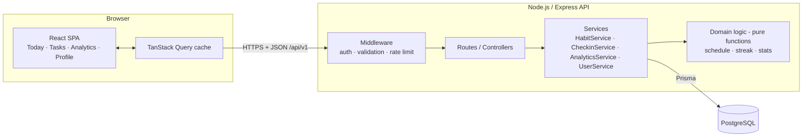
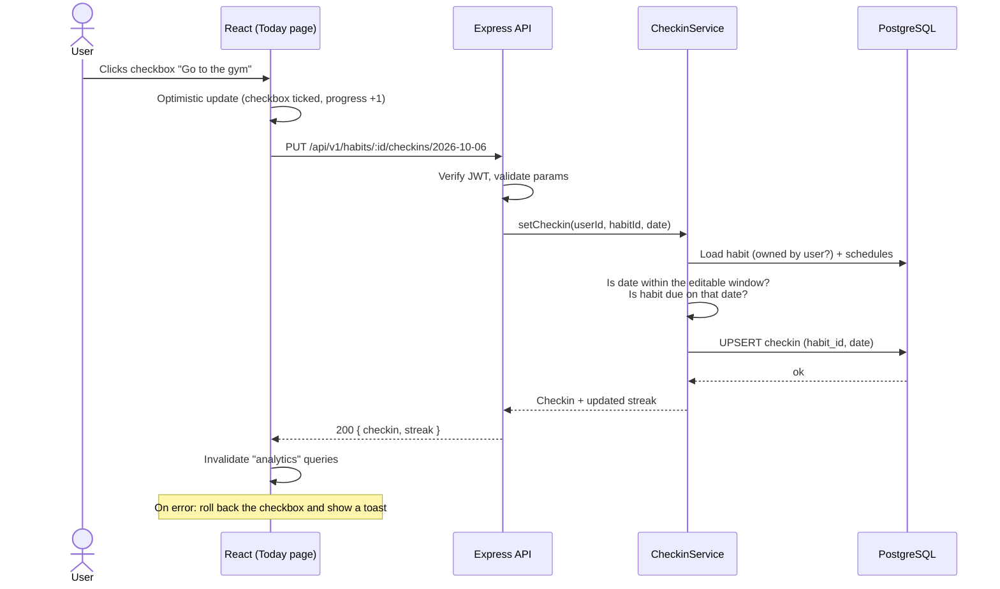
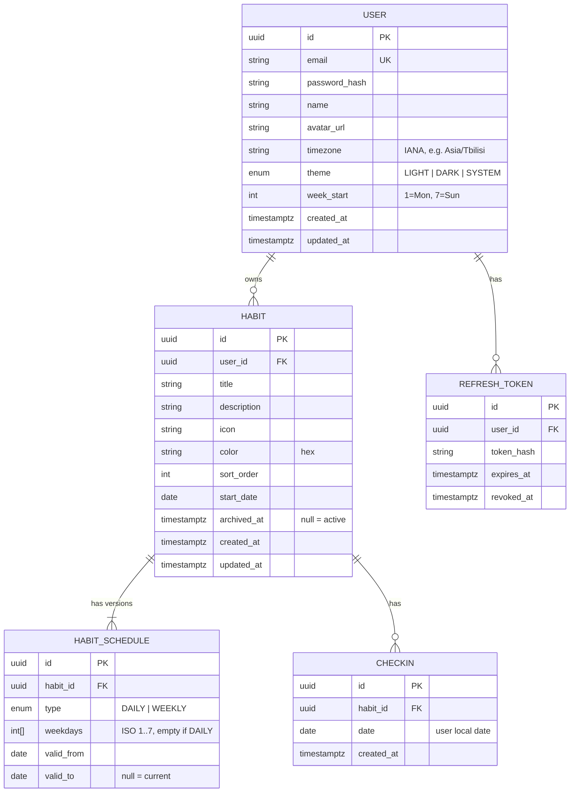
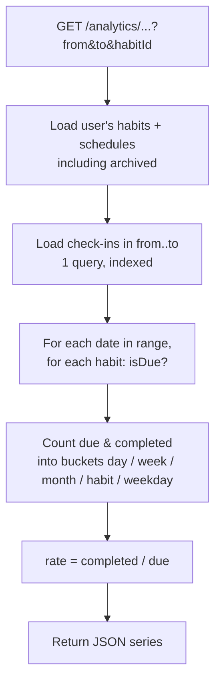
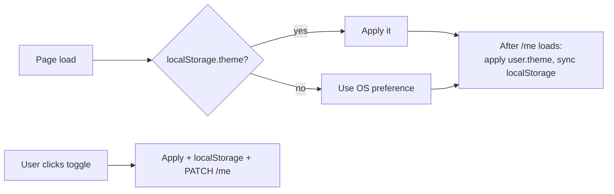

# Daily Tasks Manager — Technical Design Document (TDD)

| | |
|---|---|
| **Status** | Draft v1.0 — ready for team review |
| **Owner** | Team Lead |
| **Audience** | Frontend, backend and QA developers |
| **Repository** | `g-dolidze/todo.app` |

---

## Table of contents

1. [Summary](#1-summary)
2. [Goals and non-goals](#2-goals-and-non-goals)
3. [Glossary](#3-glossary)
4. [User stories and acceptance criteria](#4-user-stories-and-acceptance-criteria)
5. [Tech stack](#5-tech-stack)
6. [Architecture](#6-architecture)
7. [Data model](#7-data-model)
8. [Core logic: scheduling, check-ins, streaks](#8-core-logic-scheduling-check-ins-streaks)
9. [Analytics](#9-analytics)
10. [REST API](#10-rest-api)
11. [Frontend](#11-frontend)
12. [Light and dark mode](#12-light-and-dark-mode)
13. [Authentication and security](#13-authentication-and-security)
14. [Testing strategy](#14-testing-strategy)
15. [Project structure](#15-project-structure)
16. [Delivery plan](#16-delivery-plan)
17. [Open questions](#17-open-questions)

---

## 1. Summary

**Daily Tasks Manager** is a web app for building habits. A user creates **tasks they want to do regularly**,
such as *"Do exercise"*, *"Learn something new"* or *"Go to the gym"*. Each task repeats either:

- **every day**, or
- **on chosen days of the week** (for example Mon / Wed / Fri).

Every day the user opens the **Today** screen and **checks off** the tasks they did. The app keeps the history
and shows **analytics**:

- **Bar charts** for short periods (this week, last 30 days, per task, per weekday).
- **Line charts** for long periods (3 months, 6 months, 1 year), showing the trend over time.

Every user has their **own account and profile**, and can switch between **light and dark mode**.

---

## 2. Goals and non-goals

### Goals (v1)

| # | Goal |
|---|------|
| G1 | Users can register, log in and manage their own profile. |
| G2 | Users can create, edit, archive and delete recurring tasks (daily or on chosen weekdays). |
| G3 | Users can check or uncheck a task for today, and for past days (up to 7 days back). |
| G4 | Analytics: completion rate, streaks, bar charts (short term), line charts (long term). |
| G5 | Light, dark and "system" theme, saved per user. |
| G6 | Responsive UI that works on phone and desktop browsers. |

### Non-goals (v1, possible later)

- Native mobile apps.
- Push or email reminders.
- Social features (friends, sharing, leaderboards).
- Tasks repeating every N days or monthly (the data model leaves room for this, see §7.3).
- Offline mode.

---

## 3. Glossary

| Term | Meaning |
|------|---------|
| **Task** (in code: `Habit`) | Something the user wants to do regularly, e.g. "Go to the gym". We call it `Habit` in code so it isn't confused with one-off to-dos. |
| **Schedule** | Which days a task is due: `DAILY`, or `WEEKLY` with a list of weekdays. |
| **Due day** | A calendar date when the task is scheduled. |
| **Check-in** | A record that the user completed a task on a given date. |
| **Completion rate** | `completed due days / all due days` for a period, as a percentage. |
| **Streak** | Number of consecutive **due days** completed, counting back from today. Days when the task is not due do not break the streak. |
| **Local date** | A date (`YYYY-MM-DD`) in the **user's time zone**. All "day" logic uses local dates, never UTC timestamps. |

---

## 4. User stories and acceptance criteria

### 4.1 Account and profile

| ID | Story | Acceptance criteria |
|----|-------|---------------------|
| US-1 | As a visitor I can sign up with name, email and password. | Email must be unique and valid. Password needs at least 8 characters with 1 letter and 1 digit. After sign-up I am logged in. The time zone is detected from the browser automatically. |
| US-2 | As a user I can log in and log out. | Wrong credentials show a generic error ("Invalid email or password"). Logout clears the session. |
| US-3 | As a user I can view and edit my profile. | I can edit name, avatar, time zone, week start day (Mon/Sun) and theme. I can change my password if I enter the current one. |
| US-4 | As a user I can delete my account. | I must confirm with my password. All my data is deleted permanently. |

### 4.2 Tasks

| ID | Story | Acceptance criteria |
|----|-------|---------------------|
| US-5 | As a user I can create a task. | Fields: title (required, 1–80 chars), description (optional, up to 500 chars), icon/emoji, color, schedule (`DAILY` or `WEEKLY` + at least one weekday), start date (default: today). |
| US-6 | As a user I can edit a task. | A schedule change applies **from today onwards**. History and statistics for past days do not change (see §7.3). |
| US-7 | As a user I can archive a task. | Archived tasks disappear from Today but stay in analytics. They can be restored. |
| US-8 | As a user I can delete a task. | This needs confirmation. It deletes the task and all its check-ins. |
| US-9 | As a user I can reorder tasks. | Drag and drop on the Tasks page. The order is saved. |

### 4.3 Daily check

| ID | Story | Acceptance criteria |
|----|-------|---------------------|
| US-10 | As a user I see the tasks due today. | Only tasks scheduled for today (in my time zone) are shown, with a progress bar such as "3 / 5 done". |
| US-11 | As a user I can check or uncheck a task. | One click toggles it. The UI updates instantly (optimistic update) and rolls back if the request fails. |
| US-12 | As a user I can fix the last 7 days. | A date picker lets me go back up to 7 days. Future dates and older dates are read-only. |

### 4.4 Analytics

| ID | Story | Acceptance criteria |
|----|-------|---------------------|
| US-13 | As a user I see my overall stats. | KPI cards: today's progress, current best streak, completion rate for the last 7 and 30 days. |
| US-14 | As a user I see short-term bar charts. | A **bar chart** of completion % per day for the last 7 or 30 days; a bar chart of completion % per task; a bar chart of completion % per weekday. |
| US-15 | As a user I see long-term line charts. | A **line chart** of completion % over 3 months (weekly points), 6 months (weekly points) or 1 year (monthly points). |
| US-16 | As a user I can filter analytics per task. | A task selector filters every chart to "All tasks" or one task. |

---

## 5. Tech stack

| Layer | Choice | Why |
|-------|--------|-----|
| Language | **TypeScript** everywhere | One language and shared types between frontend and backend. |
| Frontend | **React 18 + Vite** | Fast dev server, widely known. |
| Routing | **React Router** | Standard. |
| Server state | **TanStack Query** | Caching and optimistic updates for check-ins. |
| Forms / validation | **React Hook Form + Zod** | The same Zod schemas validate on the server (shared package). |
| Styling | **Tailwind CSS** (`darkMode: 'class'`) | Easy light/dark theming. |
| Charts | **Recharts** | Has `BarChart` and `LineChart` built in, responsive, works with React. |
| Backend | **Node.js 20 + Express** | Simple and well known. |
| ORM | **Prisma** | Type-safe DB access and migrations. |
| Database | **PostgreSQL 16** | Relational data with good date support. |
| Auth | JWT access token plus refresh token in an **httpOnly cookie** | See §13. |
| Testing | **Vitest**, **Supertest**, **React Testing Library**, **Playwright** | See §14. |
| Tooling | pnpm workspaces, ESLint, Prettier, Husky | Monorepo with shared code. |
| CI | GitHub Actions | Lint, typecheck and tests on every PR. |
| Deploy | Frontend: Vercel. Backend and DB: Render or Railway. | Cheap and easy for v1. |

---

## 6. Architecture



**Layering rules (important):**

1. **Controllers** only parse the request, call a service and send the response. No business logic.
2. **Services** do the work: they load data, call domain functions and save data.
3. **Domain functions** in `packages/shared/src/domain` are **pure** (no DB, no `Date.now()`; "today" is
   passed in as a parameter). That makes them easy to unit-test and lets the frontend reuse them.
4. All dates that mean a "day" travel as `YYYY-MM-DD` strings. Use the `date-fns` and `date-fns-tz` libraries;
   **never** call `new Date('2026-10-06')` directly, because it parses as UTC and shifts the day.

### 6.1 Request flow example: checking a task



---

## 7. Data model

### 7.1 ER diagram



### 7.2 Constraints and indexes

| Table | Constraint / index | Reason |
|-------|--------------------|--------|
| `user` | `UNIQUE(email)` (stored lowercase) | One account per email. |
| `habit` | `INDEX(user_id, archived_at, sort_order)` | Fast Today and Tasks lists. |
| `habit_schedule` | `INDEX(habit_id, valid_from)` | Schedule lookups by date. |
| `checkin` | **`UNIQUE(habit_id, date)`** | A task can be done at most once per day, which makes the toggle idempotent. |
| `checkin` | `INDEX(habit_id, date)` | Range queries for analytics. |
| all FKs | `ON DELETE CASCADE` | Deleting a user or task removes its data. |

A row in `checkin` means **done**. No row means **not done**. "Missed" is never stored; it is
**calculated** (a due day in the past without a check-in).

### 7.3 Why schedules are versioned

When a user changes "Go to gym" from *Mon/Wed/Fri* to *every day*, last month's statistics must
**not** change. So we never edit a schedule in place:

1. Close the current version: `valid_to = yesterday`.
2. Insert a new version: `valid_from = today`, `valid_to = null`.

If the old version started today, overwrite it instead (no zero-length versions).

To find the schedule for a date `d`, use the version where `valid_from <= d AND (valid_to IS NULL OR d <= valid_to)`.

> Adding new schedule types later (e.g. `EVERY_N_DAYS`) only needs a new enum value, an extra column
> (`interval`), and a new branch in `isDue()`.

---

## 8. Core logic: scheduling, check-ins, streaks

All functions in this section live in `packages/shared/src/domain/` and are **pure**.

### 8.1 Is a task due on a date?

```ts
type ISODate = string; // 'YYYY-MM-DD'
type Weekday = 1 | 2 | 3 | 4 | 5 | 6 | 7; // ISO: 1 = Monday ... 7 = Sunday

interface Schedule {
  type: 'DAILY' | 'WEEKLY';
  weekdays: Weekday[];
  validFrom: ISODate;
  validTo: ISODate | null;
}

interface HabitForDomain {
  startDate: ISODate;
  archivedOn: ISODate | null; // local date of archived_at
  schedules: Schedule[];
}

function isDue(habit: HabitForDomain, date: ISODate): boolean {
  if (date < habit.startDate) return false;                        // not started yet
  if (habit.archivedOn && date >= habit.archivedOn) return false; // archived
  const s = habit.schedules.find(
    (v) => v.validFrom <= date && (v.validTo === null || date <= v.validTo),
  );
  if (!s) return false;
  if (s.type === 'DAILY') return true;
  return s.weekdays.includes(isoWeekday(date));                   // WEEKLY
}
```

> `ISODate` strings compare correctly with `<` and `>` because the format is fixed-width.

### 8.2 "Today" for a user

```ts
// Server: never use the server's local day. Always use the user's time zone.
const today = formatInTimeZone(new Date(), user.timezone, 'yyyy-MM-dd');
```

### 8.3 Check-in rules (server enforces them; the UI only mirrors them)

| Rule | Error |
|------|-------|
| The task belongs to the current user | `404 NOT_FOUND` (do not reveal that it exists) |
| `date <= today` (user time zone) | `422 DATE_IN_FUTURE` |
| `date >= today − 7 days` | `422 DATE_TOO_OLD` |
| `isDue(habit, date)` is true | `422 NOT_DUE` |

- `PUT` creates the check-in. Calling it twice is fine (upsert, idempotent).
- `DELETE` removes it. Calling it twice is fine (deleting nothing returns `204`).

### 8.4 Streaks

**Current streak**: walk backwards from today over **due days only**:

```ts
function currentStreak(habit, doneDates: Set<ISODate>, today: ISODate): number {
  let streak = 0;
  let d = today;
  // Today not done yet does NOT break the streak (the day isn't over).
  if (isDue(habit, d) && !doneDates.has(d)) d = addDays(d, -1);
  while (d >= habit.startDate) {
    if (isDue(habit, d)) {
      if (!doneDates.has(d)) break;
      streak++;
    }
    d = addDays(d, -1);
  }
  return streak;
}
```

**Longest streak**: the same walk forwards from `startDate` to `today`, keeping the maximum.

**Example**: a task due Mon/Wed/Fri, done Mon ✅, Wed ✅, Fri ✅, today is Sunday → streak = **3**.
Tuesday, Thursday, Saturday and Sunday don't count because the task isn't due on them.

---

## 9. Analytics

### 9.1 Base formula

For any period and any set of tasks:

```
due       = number of (task, date) pairs where isDue(task, date) and date <= today
completed = number of those pairs that have a check-in
rate      = due == 0 ? null : completed / due * 100   (rounded to 1 decimal)
```

`rate = null` means *no data* (for example the user had no tasks yet). The chart shows a **gap**, not 0%.

### 9.2 Which chart is used where

| Widget | Chart | Period | X axis | Y axis | Granularity |
|--------|-------|--------|--------|--------|-------------|
| KPI cards | numbers | today, 7d, 30d | — | — | — |
| **Daily completion** | **Bar** | last 7 or 30 days | date | % done | 1 bar per day |
| **Per task** | **Bar** (horizontal) | 7d / 30d / 90d | % done | task name | 1 bar per task |
| **Per weekday** | **Bar** | last 90 days | Mon…Sun | % done | 1 bar per weekday |
| **Long-term trend** | **Line** | 3m / 6m / 1y | week or month | % done | 3m and 6m: weekly; 1y: monthly |
| Streak history (optional) | Line | 1y | date | streak length | daily |

**Rule of thumb:** periods of **30 days or less use bars**, so each day can be compared on its own.
**Longer periods use lines**, to show the trend over time.

### 9.3 How the server calculates it



- Calculations happen **in the service, in memory**. With at most about 50 tasks × 366 days = ~18k checks,
  this is fast enough (well under 50 ms). Do not pre-aggregate in v1.
- Week buckets start on the user's `week_start`. Month buckets are calendar months.
- A partial current week or month is included and flagged `partial: true`, so the UI can draw it dashed or lighter.
- **Later optimisation (only if needed):** a nightly `daily_stats(user_id, date, due, completed)` table.

### 9.4 Response shape (shared type)

```ts
interface SeriesPoint {
  key: string;          // '2026-10-06' | '2026-W41' | '2026-10' | habitId | '1'..'7'
  label: string;        // 'Mon 6' | 'Oct 6–12' | 'Oct 2026' | 'Go to gym' | 'Mon'
  due: number;
  completed: number;
  rate: number | null;  // 0..100
  partial?: boolean;
}
```

---

## 10. REST API

Base URL: `/api/v1`. JSON only. All endpoints except `/auth/*` require `Authorization: Bearer <accessToken>`.
Request bodies are validated with **Zod** schemas from `packages/shared`.

### 10.1 Error format (for every error)

```json
{ "error": { "code": "NOT_DUE", "message": "Habit is not scheduled on 2026-10-05", "details": {} } }
```

| HTTP | When |
|------|------|
| 400 | Malformed JSON or failed validation (`VALIDATION_ERROR`, `details` holds the field errors) |
| 401 | Missing or expired token (`UNAUTHORIZED`) |
| 404 | Resource does not exist **or belongs to someone else** |
| 409 | Conflict, e.g. `EMAIL_TAKEN` |
| 422 | Business rule broken (`DATE_IN_FUTURE`, `DATE_TOO_OLD`, `NOT_DUE`) |
| 429 | Rate limited |

### 10.2 Endpoints

**Auth**

| Method | Path | Body | Response |
|--------|------|------|----------|
| POST | `/auth/register` | `{ name, email, password, timezone }` | `201 { accessToken, user }` + refresh cookie |
| POST | `/auth/login` | `{ email, password }` | `200 { accessToken, user }` + refresh cookie |
| POST | `/auth/refresh` | — (cookie) | `200 { accessToken }` (rotates refresh token) |
| POST | `/auth/logout` | — | `204`, revokes the refresh token |

**Profile**

| Method | Path | Body | Response |
|--------|------|------|----------|
| GET | `/me` | — | `200 User` |
| PATCH | `/me` | `{ name?, avatarUrl?, timezone?, theme?, weekStart? }` | `200 User` |
| PUT | `/me/password` | `{ currentPassword, newPassword }` | `204` |
| DELETE | `/me` | `{ password }` | `204` |

**Tasks (habits)**

| Method | Path | Body / Query | Response |
|--------|------|--------------|----------|
| GET | `/habits` | `?status=active\|archived\|all` | `200 Habit[]` (with current schedule) |
| POST | `/habits` | `{ title, description?, icon?, color?, startDate?, schedule: { type, weekdays? } }` | `201 Habit` |
| GET | `/habits/:id` | — | `200 Habit` + `currentStreak`, `longestStreak` |
| PATCH | `/habits/:id` | any of the POST fields | `200 Habit` (a schedule change creates a new version) |
| POST | `/habits/:id/archive` | — | `200 Habit` |
| POST | `/habits/:id/restore` | — | `200 Habit` |
| DELETE | `/habits/:id` | — | `204` |
| PUT | `/habits/order` | `{ ids: uuid[] }` | `204` |

**Today and check-ins**

| Method | Path | Response |
|--------|------|----------|
| GET | `/today?date=YYYY-MM-DD` (default: today) | `200 { date, items: [{ habit, done, streak }], done, total }` |
| PUT | `/habits/:id/checkins/:date` | `200 { checkin, currentStreak }` |
| DELETE | `/habits/:id/checkins/:date` | `200 { currentStreak }` |

**Analytics** (all accept `habitId?` to filter to one task)

| Method | Path | Query | Response |
|--------|------|-------|----------|
| GET | `/analytics/summary` | — | `{ today: {done,total}, rate7d, rate30d, bestCurrentStreak, longestStreak }` |
| GET | `/analytics/daily` | `range=7d\|30d` | `SeriesPoint[]` (one per day) → bar chart |
| GET | `/analytics/by-habit` | `range=7d\|30d\|90d` | `SeriesPoint[]` (one per task) → bar chart |
| GET | `/analytics/by-weekday` | `range=90d` | `SeriesPoint[]` (7 points) → bar chart |
| GET | `/analytics/trend` | `range=3m\|6m\|1y` | `SeriesPoint[]` (weeks or months) → line chart |

---

## 11. Frontend

### 11.1 Pages and routes

| Route | Page | Main content |
|-------|------|--------------|
| `/login`, `/register` | Auth | Forms. Redirect to `/` if already logged in. |
| `/` | **Today** | Date switcher (‹ today ›, max 7 days back), progress bar, list of due tasks with checkboxes and streak 🔥. |
| `/habits` | **Tasks** | All tasks, drag to reorder, add/edit dialog, archive/delete, "Archived" tab. |
| `/analytics` | **Analytics** | Task filter, KPI cards, daily **bar**, per-task **bar**, per-weekday **bar**, trend **line** with 3m/6m/1y tabs. |
| `/profile` | **Profile** | Avatar, name, email (read-only), time zone, week start, theme toggle, change password, delete account. |

Every page except auth sits inside `AppLayout`: a top bar (logo, theme toggle, avatar menu) plus side navigation
on desktop or bottom navigation on mobile.

### 11.2 Task form: schedule selector

```
Repeat:   (●) Every day   ( ) On specific days
Days:     [Mon] [Tue] [Wed] [Thu] [Fri] [Sat] [Sun]   ← shown only for "specific days", at least 1 required
```

### 11.3 State management

- **Server data** (habits, today, analytics, profile) lives only in **TanStack Query**. Query keys:
  `['me']`, `['habits', status]`, `['today', date]`, `['analytics', kind, range, habitId]`.
- **Check-in toggle** uses an optimistic update on `['today', date]`. On success it invalidates `['analytics']`
  and `['habits']` (because streaks change).
- **UI-only state** (open dialogs, selected tab) stays in React component state. No Redux needed.
- **Auth**: the access token is kept **in memory** (an `AuthContext`), never in `localStorage`. On a 401 the API client calls
  `/auth/refresh` once, then retries the request; if refresh fails it redirects to `/login`.

### 11.4 Charts (Recharts)

- Wrap every chart in `ResponsiveContainer` so it works on mobile.
- Y axis is always **0–100 %**, so charts are comparable.
- `rate === null` → bar not drawn / line gap (`connectNulls={false}`).
- Tooltip shows `completed / due (rate%)`, for example *"4 / 5 (80%)"*.
- Chart colors come from CSS variables (§12), so charts follow the theme automatically.
- Each chart has an empty state ("No data yet — check in a few days to see your progress").

---

## 12. Light and dark mode

**Options:** `LIGHT`, `DARK`, `SYSTEM` (follows the OS setting). The default for new users is `SYSTEM`.

**How it works:**

1. Colors are defined **once** as CSS variables and Tailwind uses them:
   ```css
   :root      { --bg: #ffffff; --surface: #f6f7f9; --text: #111827; --primary: #4f46e5; --chart-1: #4f46e5; }
   .dark      { --bg: #0f1115; --surface: #181b22; --text: #e5e7eb; --primary: #818cf8; --chart-1: #818cf8; }
   ```
2. The `dark` class on `<html>` switches the theme (`darkMode: 'class'` in Tailwind).
3. **Avoid a flash of the wrong theme:** a small inline script in `index.html` runs before React loads.
   It reads the theme from `localStorage` and sets the class immediately.
4. After login, the **server value** (`user.theme`) is the source of truth. It is copied to `localStorage` and applied.
5. Toggling the theme updates the UI instantly, saves to `localStorage`, and sends `PATCH /me { theme }`.
6. With `SYSTEM`, listen to `matchMedia('(prefers-color-scheme: dark)')` changes and update live.



**Rule:** no hard-coded colors in components. Always use the theme tokens. Both themes must meet WCAG AA contrast.

---

## 13. Authentication and security

| Topic | Decision |
|-------|----------|
| Passwords | Hashed with **argon2id** (or bcrypt with cost 12). Never logged. |
| Access token | JWT, valid **15 min**, payload `{ sub: userId }`, kept in memory on the client. |
| Refresh token | Random 256-bit value, valid **30 days**, stored **hashed** in DB, sent as a `httpOnly; Secure; SameSite=Strict` cookie on path `/api/v1/auth`. **Rotated** on every refresh; reuse of an old token revokes all of the user's tokens. |
| Authorization | **Every** query is scoped by `userId` from the token (`where: { id, userId }`). Another user's resource → `404`. |
| Validation | Zod on every body, param and query. Reject unknown fields. |
| Rate limiting | `/auth/*`: 10 requests/min per IP. Everything else: 300 requests/min per user. |
| Headers | `helmet`, CORS allowing only the frontend origin. |
| Secrets | Only in environment variables (`DATABASE_URL`, `JWT_SECRET`, …). `.env` is git-ignored; `.env.example` is committed. |
| Account deletion | Hard delete with cascade. |

---

## 14. Testing strategy

We use **test-driven development** for the domain logic and the API: **write the failing test first**,
then the code, then refactor.

### 14.1 Test pyramid

| Level | Tool | What | Target |
|-------|------|------|--------|
| **Unit** | Vitest | `isDue`, streaks, analytics bucketing, date helpers, Zod schemas | **≥ 95 %** coverage of `packages/shared/src/domain` |
| **Integration (API)** | Vitest + Supertest + real Postgres (Docker / Testcontainers) | Every endpoint: happy path, validation, auth, ownership | Every endpoint and every error code |
| **Component** | Vitest + React Testing Library | Forms, Today list toggle and rollback, theme toggle, chart empty states | Key components |
| **E2E** | Playwright | Critical user journeys in a real browser | 5 journeys below |

### 14.2 Must-have unit test cases

| Function | Cases |
|----------|-------|
| `isDue` | Daily task is due every day · Weekly Mon/Wed/Fri is due only on those days · Before `startDate` → false · On or after archive date → false · Schedule changed mid-month: old days use the old schedule, new days use the new one |
| `currentStreak` | No check-ins → 0 · Today not done yet doesn't break the streak · A missed due day breaks it · Non-due days are skipped (Mon/Wed/Fri example = 3) · Streak does not go before `startDate` |
| `longestStreak` | Picks the maximum run across gaps |
| Analytics | `due = 0` → `rate = null` · Week buckets respect `weekStart` · Partial current week flagged · Archived tasks counted only before archive · Future days never counted |
| Dates | User in `Pacific/Auckland` vs `America/Los_Angeles`: "today" differs at the same instant · DST change days have no missing or duplicated date |

### 14.3 API integration cases (examples)

- `PUT /habits/:id/checkins/:date` twice → still exactly 1 row (idempotent).
- Check-in for a future date → `422 DATE_IN_FUTURE`; 8 days ago → `422 DATE_TOO_OLD`; non-due day → `422 NOT_DUE`.
- User A requests user B's habit → `404`.
- `PATCH /habits/:id` with a new schedule → past analytics unchanged, new schedule active from today.
- Register with an existing email → `409 EMAIL_TAKEN`.
- Refresh token reused after rotation → `401` and all of the user's sessions revoked.

### 14.4 E2E journeys (Playwright)

1. Sign up → create "Go to gym" (Mon/Wed/Fri) → it appears on Today only on those days.
2. Check a task → progress bar updates → reload → still checked.
3. Analytics shows a bar for today with the correct % and switches to the line chart for 3 months.
4. Toggle dark mode → reload → still dark; log in on another browser → dark too.
5. Edit profile name and time zone → Today recalculates.

> Tests that depend on "today" must **freeze time** (`vi.setSystemTime` / Playwright `clock`) so they are stable.

### 14.5 CI (GitHub Actions, on every PR)

`pnpm install` → `lint` → `typecheck` → `test:unit` → `test:api` (Postgres service container) → `build` → `test:e2e`.
**A PR cannot be merged unless CI is green** and at least one teammate has approved it.

---

## 15. Project structure

```
todo.app/
├─ apps/
│  ├─ web/                    # React SPA
│  │  ├─ src/
│  │  │  ├─ api/              # fetch client, refresh logic, query hooks
│  │  │  ├─ components/       # UI kit: Button, Checkbox, Dialog, charts/…
│  │  │  ├─ features/
│  │  │  │  ├─ auth/
│  │  │  │  ├─ today/
│  │  │  │  ├─ habits/
│  │  │  │  ├─ analytics/     # DailyBarChart, HabitBarChart, WeekdayBarChart, TrendLineChart
│  │  │  │  └─ profile/
│  │  │  ├─ theme/            # ThemeProvider, tokens.css
│  │  │  ├─ routes.tsx
│  │  │  └─ main.tsx
│  │  └─ e2e/                 # Playwright
│  └─ api/                    # Express server
│     ├─ prisma/schema.prisma
│     ├─ src/
│     │  ├─ modules/
│     │  │  ├─ auth/          # auth.routes.ts, auth.controller.ts, auth.service.ts
│     │  │  ├─ users/
│     │  │  ├─ habits/
│     │  │  ├─ checkins/
│     │  │  └─ analytics/
│     │  ├─ middleware/       # requireAuth, validate, errorHandler, rateLimit
│     │  ├─ lib/              # prisma client, jwt, errors (AppError)
│     │  └─ server.ts
│     └─ test/                # integration tests
├─ packages/
│  └─ shared/                 # used by BOTH web and api
│     └─ src/
│        ├─ domain/           # isDue, streaks, analytics bucketing (pure + unit tested)
│        ├─ schemas/          # Zod schemas = API contract
│        └─ types.ts
├─ docs/TDD.md                # this document
├─ docker-compose.yml         # local Postgres
├─ .github/workflows/ci.yml
└─ package.json               # pnpm workspaces
```

### 15.1 Coding conventions

- Branch names: `feature/<short-name>`, `fix/<short-name>`. One feature per PR, small PRs.
- Commits: Conventional Commits (`feat:`, `fix:`, `test:`, `docs:`…).
- No `any`. No business logic in controllers or React components; put it in services or `shared/domain`.
- Every new endpoint or domain function comes **with tests in the same PR**.

---

## 16. Delivery plan

| Milestone | Scope | Done when |
|-----------|-------|-----------|
| **M0 — Setup** (2 days) | Monorepo, lint/format, CI, Docker Postgres, Prisma schema + migration, empty React app with routing and theme tokens | CI green on an empty app; `docker compose up` + `pnpm dev` works |
| **M1 — Auth & Profile** | Register, login, refresh, logout, `/me` CRUD, profile page, **light/dark mode** | US-1..US-4 pass; E2E journey 4 passes |
| **M2 — Tasks** | Domain `isDue` + schedule versioning, habits CRUD, archive, reorder, Tasks page | US-5..US-9 pass |
| **M3 — Daily check** | `/today`, check-in endpoints, streaks, Today page with optimistic toggle | US-10..US-12; E2E journeys 1–2 |
| **M4 — Analytics** | Analytics service + endpoints, KPI cards, **bar charts**, **line chart** | US-13..US-16; E2E journey 3 |
| **M5 — Polish & release** | Empty states, loading skeletons, accessibility pass, mobile layout, deploy | All E2E journeys green on staging |

**Parallel work:** after M0, a backend developer can work on M2/M3 APIs while a frontend developer builds pages against
the Zod contract in `packages/shared` (with mocked responses via MSW).

---

## 17. Open questions

| # | Question | Proposed default |
|---|----------|------------------|
| Q1 | Should users be able to log a **number** (e.g. "30 min", "10 pages") instead of only done/not done? | No for v1; possible `value` column later. |
| Q2 | How many days back can a user edit check-ins? | 7 days. |
| Q3 | Do we need social login (Google)? | Not in v1. |
| Q4 | Avatar upload or URL / initials only? | Initials + optional image upload in M5. |
| Q5 | Languages (English / Georgian)? | English first; wrap strings with i18n from the start so Georgian is easy to add. |
